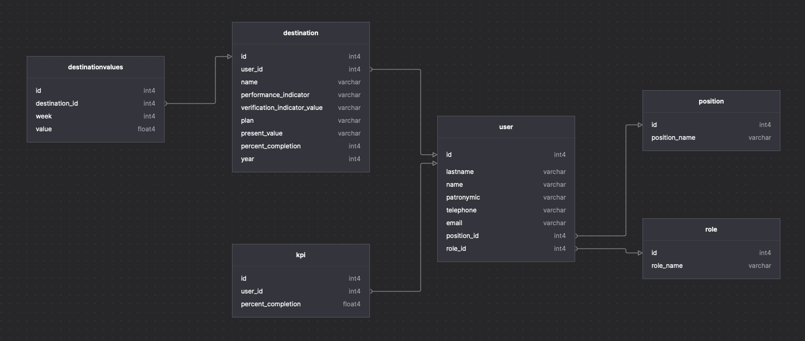

# API MANUAL
---
## DATABASE DIAGRAM

---

## destinations

### get
| Option | Type |
| ------:| -----------:|
|destinationId*|int|

### getPossible
| Option | Type |
| ------:| -----------:|
|userId*|int|

### getValues
| Option | Type |
| ------:| -----------:|
|destinationId*|int|

### create
| Option | Type |
| ------:| -----------:|
|user*| int |
|name*| str |
|performanceIndicator*| str|
|verificationIndicatorValue*| str |
|year*| int |
|plan*| str |
|presentValue*| str |
|percentCompletion*| int|

### createValues
| Option | Type |
| ------:| -----------:|
|destinationId*|int|
|week*|int|
|value*|float|

---

## users

### get
| Option | Type |
| ------:| -----------:|
|userId*|int|

### getPossible
| Option | Type |
| ------:| -----------:|
|positionId?|int|
|roleId?|int|

---

## positions

### getPossible
---

## roles

### getPossible

---